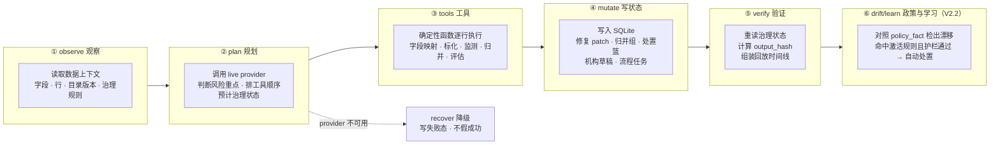
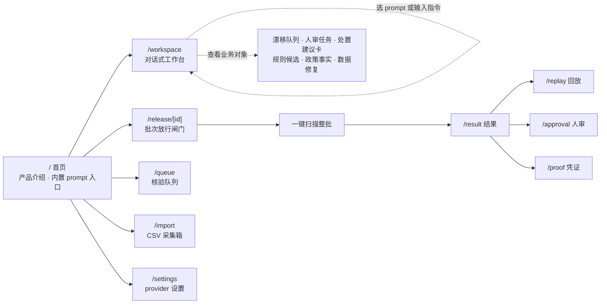
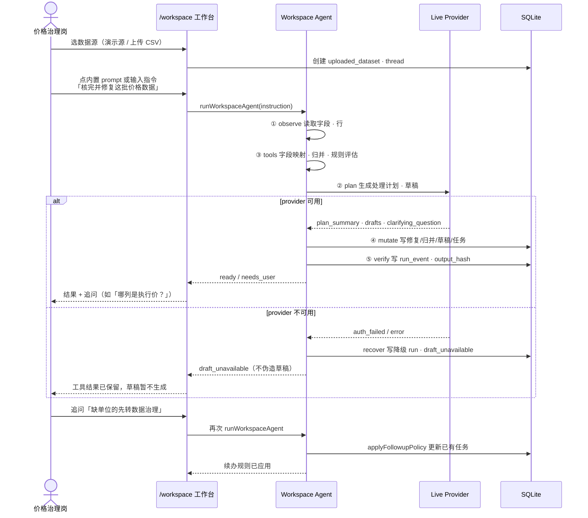
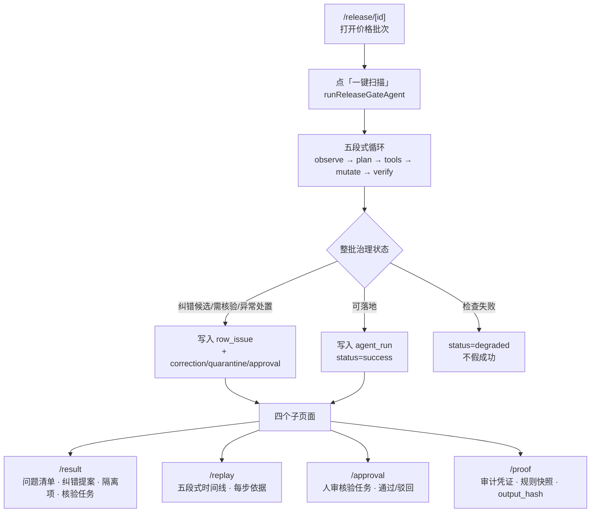
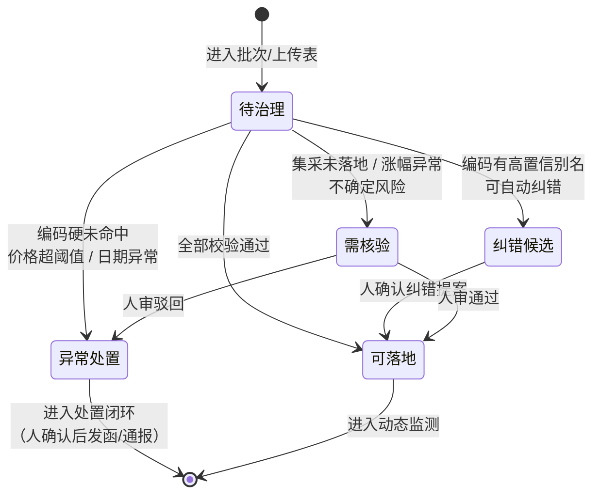

# 价序 · 项目说明

> 一句话：把医保价格治理岗每天面对的一堆没排好顺序的价格表，交给一个会读字段、会归并同品、会换算单位、会发起流程的智能体工作台；政策一变，它自己对照政策事实复核存量执行价，人审结论沉淀成规则，下批自动处置。
>
> 适用对象：2026 全国智慧医保大赛评委、内部评审。复制本文粘贴进飞书文档即可，Mermaid 图可用「飞书 → 插入 → 代码块」渲染，或贴入 mermaid.live 导出 PNG。
>
> 版本：V2.2。针对一线反馈新增政策对齐 + 自学习闭环：政策事实版本化、公告同步人审确认、每次 run 检出政策漂移、人审结论挖掘成规则候选、dry-run 后人审激活、护栏内自动处置、不可变决策日志。

---

## 1. 业务价值：这件工作现在的痛点是什么

医保价格治理岗每天打开电脑，面对的不是一张干净的表。昨夜新增的机构执行价、集采采购进度、目录别名、投诉线索、昨日没回访完的事项，全混在几个 CSV 和工单里。工作人员要先判断今天哪几件最该办，哪些要补证，哪些要派核验，哪些只能先观察。

这件事难，不是因为某一步计算有多复杂，而是因为步骤多、口径碎、判断要回到目录和规则上。同一个药品，不同来源叫不同名字，单位也不一样；集采中选价要在已落地区域内才生效；参考价涨幅超阈值要核验；编码没命中目录又不能直接判异常。一个工作人员一天能手动核的行数有限，剩下的要么排队，要么漏掉。

价序把这件工作做成一个工作台。用户上传一张表或接入一个数据源，用一句话说要做什么，比如「核完并修复这批价格数据」或「找出集采落地差异并生成催办口径」。智能体读完字段，把同品同规归并，换算单位，对齐价格，筛掉假异常，把可以处置的项写成机构核实草稿和流程任务，所有状态写进 SQLite。拿不准的它会问，不硬写。

对业务的意义，落到三件事上：

- 把「今天先办谁、为什么、缺什么证据」这件早上排序的工作，从人脑挪到智能体上。工作人员从逐行核价，变成复核智能体已经排好的处置顺序和草稿。
- 每一步都有回放。发函、通报、违规认定这类对外动作仍由人确认，但智能体把前置的字段标化、归并、规则评估、草稿生成全做完了，并且每一行是怎么走到流程任务的，都能查到。
- 失败不假成功。Provider 不可用时，系统写失败态，不会拿本地规则包装成一个看起来正常的结论。在医保这种强合规场景，这一点比跑得快更重要。

V2.2 又针对一线医保老师的两句反馈补了一段闭环。第一句是「政策实时更新，数据常跟政策对不上」：中选价、最高有效价一调整，昨天核过的存量执行价今天就可能不合规，但没人手一条条重核。价序把政策口径做成版本化的政策事实（policy_fact），支持从国家医保局公开公告页真实抓取、公告 hash 留痕、人审确认后才生效；每次 run 都对照最新基线重核存量，检出的漂移进「漂移队列」，高危自动生成复核任务。第二句是「审批负担太重，审完的经验没人记住」：价序把每一次人审批准连同问题类型、严重度、处置动作写进不可变决策日志，从中挖掘规则候选，dry-run 预览影响面、人审激活后，下批命中的非敏感项自动处置——审批负担随使用递减，而高危项被护栏永久留在人审。

覆盖的赛题范围：医药价格数据标化治理、药品及医用耗材价格动态监测、价格异常预警与处置、集采价格落地跟踪。

---

## 2. AI 在哪里：为什么智能体是核心，而不是装饰

先说清楚价序不是什么。它不是一个把 CSV 渲染成大屏的可视化工具，也不是一张带「AI 辅助」按钮的审计表。这两种做法把 AI 放在边缘，主体仍是固定流程。

价序把智能体放在关键路径上。每一次任务执行，模型都要做一件事：读完这批数据的观察结果，判断主要治理风险在哪，决定调哪些确定性工具、按什么顺序、预计把整批推进到哪个治理状态。这是 `runReleaseGateAgent` 和 `runWorkspaceAgent` 里 `generateAgentPlan` / `generateWorkspacePlan` 那一步，在写任何状态之前发生。

为什么这样设计是核心：

第一，价格治理的判断不是「跑一个规则引擎」。规则引擎只能告诉你某一行命中了哪条规则，但它不告诉你这批数据整体的风险重点是什么、该先催哪一类机构、哪个字段缺失值得为它拦下整批。这部分判断需要读完上下文再做权衡，是模型擅长的事。

第二，工具是确定性的，决策不是。字段映射、单位换算、同品归并、价格对齐、规则评估，全是服务端可复算的确定性函数（见 `workspaceTools.ts` 和 `tools.ts`）。模型不直接算这些，它只决定调哪些、按什么顺序。这样既保留了模型在规划上的灵活性，又保证每一次工具调用都可以被独立复查和复算。这是「可审计的智能体」而不是「黑盒魔法」。

第三，状态写入有边界。智能体只写内部工作状态：字段映射、修复 patch、归并组、价格口径、处置篮、机构草稿、流程任务。发函、通报、违规认定、关闭线索这类对外动作，必须由业务人员确认。模型可以起草机构核实口径，但发不发出去由人定。

第四，失败诚实。Provider 返回 `auth_failed` 或不可用时，系统写入降级 run，治理状态置为「检查失败」，不生成假线索、不伪造草稿。在医保场景，一个假的「可落地」比一个诚实的「检查失败」危险得多。

一句话区分：传统做法是「人调工具」，价序是「智能体调工具，人复核智能体」。

---

## 3. 技术实现：整体思路

### 3.1 两个入口，同一个内核

价序有两个面向用户的入口，共享同一套智能体内核：

| 入口 | 路径 | 形态 | 适用场景 |
|------|------|------|----------|
| 对话式工作台 | `/workspace` | 自由指令 + 5 个内置 prompt | 日常治理、逐批交互、追问续办 |
| 批次放行闸门 | `/release/[id]` | 一键扫描整批 → 结果/回放/审批/凭证 | 批量监测、整批放行决策、审计取证 |

两个入口背后是两个 agent runner，但循环结构相同。下面先讲共用的循环，再讲各自的差异。

### 3.2 智能体循环：observe → plan → tools → mutate → verify（+drift/learn）

每一次任务执行都走完核心五段，V2.2 在 verify 之后追加两个条件段：drift（对照政策事实基线检出漂移）和 learn（应用已激活的学习规则自动处置）。每一步都把状态写到 SQLite，评委可以从回放里看到它当时为什么这么做。



各阶段的职责切分很清楚：

- **observe**：读取数据上下文。价格批次或上传表的字段、行数、目录版本、治理规则，抽样后交给规划器参考。
- **plan**：调用 live provider。这是 AI 真正介入的地方。模型读完观察结果，输出主要风险重点、有序的工具调用步骤、预计的治理状态、机构核实草稿。在写任何状态之前发生。
- **tools**：确定性函数逐行执行。字段映射、价格目录标化、参考价监测、集采落地跟踪、异常画像。每一行都跑同一组校验，结果都是结构化对象，可复算。
- **mutate**：写状态到 SQLite。修复 patch、归并组、单位换算、价格口径、处置篮、机构草稿、流程任务，每类对象一张表。
- **verify**：重读治理状态，计算 output_hash，组装回放时间线。评委拿到 run id 就能复跑。
- **drift（V2.2）**：对照版本化 policy_fact 基线重核本批归并结果，检出集采超容忍、超最高有效价、编码失效等政策漂移，落 `policy_drift_log`；高危漂移自动生成「政策漂移复核」人审任务。
- **learn（V2.2）**：对本批处置项应用已激活的学习规则；命中且确定性护栏通过的自动处置（`auto_approved`），敏感项强制转人审（`needs_human`），全部写进不可变 `approval_decision_log`。

降级路径是显式的：provider 不可用时不走 tools 之后的写状态，直接 recover，治理状态置为「检查失败」。

### 3.3 技术栈与关键约定

- 前端：Next.js 15（App Router）+ React 19 + Radix Themes + Tailwind 4。
- 后端：Next.js Route Handler，服务端执行所有工具调用和状态写入。
- 模型：OpenAI 兼容 live provider，通过 `src/lib/provider.ts` 调用，关键路径实时调用，不预写结论。
- 持久化：SQLite（node:sqlite），所有状态本地落库，可回放、可追问、可退回人工确认。
- 数据：合成/脱敏 fixtures（`src/lib/fixtures.ts`、`src/lib/seed.ts`），不含真实患者、医院、企业、采购或医保生产数据。

几条关键工程约定，直接决定可信度：

1. 模型只规划，不写库。所有写库动作由确定性代码完成，模型输出的是 plan，不是 SQL。
2. 工具结果可复算。同一份输入跑两次，tools 阶段结果一致；output_hash 可以验证整批结论没被篡改。
3. 失败不静默。坏 key 返回 `auth_failed`，降级 run 写进 `agent_run` 表，`status=degraded`，不混在成功 run 里。
4. 人审边界写死在代码里。`mutation_type` 只能是内部工作对象，对外动作不在这条路径上。

### 3.4 目录结构速查

```
src/
├── app/
│   ├── workspace/          # 对话式工作台入口
│   ├── release/[id]/       # 批次放行闸门入口
│   │   ├── result/         # 扫描结果（问题/纠错/隔离/核验）
│   │   ├── replay/         # 五段式回放时间线
│   │   ├── approval/       # 人审核验任务
│   │   └── proof/          # 审计凭证导出
│   ├── queue/              # 核验队列
│   ├── import/             # CSV 采集箱
│   └── settings/           # provider 设置
├── components/             # WorkspaceClient · ReleaseGate · ReplayTimelineView 等
└── lib/
    ├── agent/
    │   ├── runWorkspaceAgent.ts      # 工作台 agent runner（含 drift/learn 段）
    │   ├── runReleaseGateAgent.ts    # 放行闸门 agent runner
    │   ├── workspaceTools.ts         # 工作台确定性工具
    │   └── tools.ts                  # 放行闸门确定性校验器
    ├── policy/fetcher.ts    # V2.2 政策同步：公告抓取 → artifact 人审确认 → policy_fact
    ├── workspace/
    │   ├── repo.ts          # SQLite 读写
    │   ├── drift.ts         # V2.2 政策漂移检测（对照 policy_fact 基线）
    │   ├── guardrails.ts    # V2.2 自动审批护栏（敏感项一律人审）
    │   ├── rules.ts         # V2.2 规则挖掘 / dry-run / 激活 / 复用
    │   └── taskDecision.ts  # V2.2 人审决策 + 不可变决策日志
    ├── provider.ts          # OpenAI 兼容 live provider
    └── fixtures.ts          # 合成/脱敏数据
```

V2.2 新增 API：`/api/workspace/policy-sync`（公告真实抓取）、`policy-artifacts`（公告确认）、`policy-facts`、`policy-update`（政策变更演示）、`policy-drifts`、`rule-candidates`（挖掘/dry-run/激活）、`tasks/[id]`（人审 + final_action）、`decision-log`、`metrics`。

---

## 4. 交互与设计：关键流程和界面

### 4.1 页面地图



#### 首页实拍

首页（`/`）讲清楚产品做什么，并提供进工作台的内置 prompt 入口（hero prompt 主打政策闭环）。下半页是智能体七步循环（observe/plan/tools/mutate + V2.2 的 drift/learn + verify）、业务对象落库图和可复跑凭证。


### 4.2 流程一：对话式工作台（`/workspace`）

这是日常治理的主入口。工作人员用自然语言驱动，不用点固定按钮。



#### 工作台界面实拍

一次完整任务的样子，按时间顺序：

1. **空工作台**：还没接数据。顶部是四个内置 prompt。


2. **接入数据源**：演示数据源读进来，字段和行可见。


3. **执行中**：点 prompt 后，输入框显示当前指令，页面进入运行态。


4. **结果回来**：右侧对话给出处置摘要和追问。


5. **生成对象**：六个业务页签里的具体产物。字段映射与修复 patch 在「数据修复」，流程任务与机构草稿在「人审任务」「处置建议卡」。


6. **追问续办**：在输入框改一句规则，已有任务被更新。


工作台顶部有四个内置 prompt（landing 首页同款，点了直接深链进工作台带指令跑），hero prompt 主打 V2.2 的政策闭环场景：

| Prompt | 做什么 |
|--------|--------|
| 核完并闭环处置这批机构执行价异常（hero） | 对照最新政策事实核存量执行价：检出漂移建复核任务；命中激活规则的自动处置；其余转人审；人审结论沉淀为规则候选 |
| 核完并修复这批价格数据 | 能确定的先修，拿不准的问，可处置的生成机构核实口径和流程任务 |
| 找出集采落地差异并生成催办口径 | 找未落地行，生成催办机构口径和内部流程任务 |
| 生成需要发起的数据治理确认 | 缺字段、缺单位的先不催医院，转数据治理 |

生成结果按价格治理岗的业务对象分六个页签：漂移队列、人审任务、处置建议卡、规则候选、政策事实、数据修复。每个对象都能追到它来自哪一行、为什么生成，右侧底部的审计日志条展示 needs_human / human_approved / auto_approved 全部决策留痕。

### 4.2.1 V2.2 政策对齐与自学习闭环（实拍）

政策事实页签是政策口径的真相源：每条政策事实带来源 hash，支持「政策同步」从国家医保局公开公告页真实抓取（公告 hash 留痕、人审确认后才生效），也提供「政策变更演示 640→560」按钮做离线演示。


政策变更后重跑，漂移队列当场检出存量执行价的政策漂移（集采超容忍 / 超最高有效价 / 编码失效），标出 baseline → observed 与严重度，高危项自动生成「政策漂移复核」人审任务：


### 4.3 流程二：批次放行闸门（`/release/[id]`）

这是整批监测和放行决策的入口。一键扫描整批，结果落在四个子页面，分别对应不同角色。



四个子页面的分工：

- **/result 结果**：这一批扫出来多少问题，分到纠错候选、异常处置、需核验各多少。每个问题指到具体行和字段，附命中规则。
- **/replay 回放**：五段式时间线，observe 读到了什么、plan 判断风险重点是什么、tools 跑了哪些校验命中哪些 finding、mutate 写了什么、verify 重读状态对不对得上。评委追问「它当时为什么这么做」，答案在这里。
- **/approval 人审**：智能体路由出来的待核验任务，业务人员在这里通过或驳回。这是人审边界落地的地方。
- **/proof 凭证**：审计导出。规则快照、目录版本、output_hash，证明这次结论是在哪个版本的规则和数据下得出的。

### 4.4 状态流转：一行价格记录怎么走

从一行原始记录到最终落点，中间的判断分支。两个入口共用同一套状态词。



状态聚合规则（写死在 `aggregateState`）：只要有一行需异常处置，整批就是异常处置；否则有需核验则整批需核验；否则有可纠错则纠错候选；全部通过才可落地。这个优先级保证最严重的问题不会被轻量问题盖掉。

### 4.5 移动端适配

工作台在手机上也能用，对话、prompt、生成对象都做了响应式。价格治理岗不一定总在电脑前。


### 4.6 失败态：provider 不可用时界面怎么表现

这是评委常追问的一点，单独说明。坏 key 或 provider 不可用时：

- 工作台：工具结果（字段映射、归并、规则评估）保留并展示，因为这部分是确定性计算，不依赖模型。但机构口径草稿位置显示「草稿暂不生成」，状态为 `draft_unavailable`，不拿本地模板填一个看起来像样的草稿。
- 放行闸门：整批治理状态置为「检查失败」，`agent_run.status=degraded`，replay 时间线里有一段红色的 recover 记录，写明失败原因。
- 验证路径：`node scripts/screenshot-failure.mjs` 用坏 key 起隔离实例复现，期望 `auth_failed` + `draft_unavailable`，截图 `docs/screenshots/09-workspace-provider-failure.png` 不伪造成功。

---

## 5. 演示路径（给评委的复跑清单）

### 5.1 对话式工作台（V2.2 主演示线）

1. 打开 `/`，看实时工作台统计；点 hero prompt「核完并闭环处置这批机构执行价异常」，深链进 `/workspace`，演示数据源自动接入，agent 当场跑。
2. 右侧「政策事实」页签点「政策变更演示 640→560」（或「政策同步」真实抓取国家医保局公告 → 公告下人审确认），重跑 hero prompt。
3. 「漂移队列」看检出的存量执行价漂移；高危漂移已自动生成「政策漂移复核」人审任务。
4. 「人审任务」逐条批准并选处置动作（final_action）；「规则候选」点挖掘 → dry-run 看影响面 → 人审激活。
5. 再跑一次：命中激活规则且护栏通过的项显示「自动处置」，敏感项仍留人审；底部审计日志条 needs_human / human_approved / auto_approved 全留痕。
6. 回 needs_user 追问（如「把重点机构排前面，缺包装单位的先转数据治理确认」），任务/草稿重排；对话区看工具轨迹回放和 output_hash。

### 5.2 批次放行闸门

1. 打开 `/release/REL-2026-0623-07`（或从首页进入）。
2. 点「一键扫描」。
3. 进 `/result` 看问题分布。
4. 进 `/replay` 看五段式时间线。
5. 进 `/approval` 看待核验任务。
6. 进 `/proof` 看审计凭证。

### 5.3 验证命令

```bash
npm install
npm run creds        # 配置 provider key
npm run build
npm run start

# 另开终端跑验证
DEMO_URL=http://127.0.0.1:3000 npm run smoke:agent   # 期望 15/15 通过
DEMO_URL=http://127.0.0.1:3000 npm run verify:v2     # 期望 17/17 通过（V2.2 政策同步→漂移→人审→挖掘→激活→自动处置全链路）
DEMO_URL=http://127.0.0.1:3000 npm run shots         # 生成截图 01-08、10-14（14 需 live provider 跑批次闸门）
```

---

## 6. 边界与诚实声明

- 演示数据是合成/脱敏数据，不含真实患者、医院、企业、采购或医保生产数据。
- 当前没有接入真实省级招采平台、HIS、医院系统或生产工单。后续可接。
- 智能体只写内部工作状态。发函、通报、违规认定、关闭线索由业务人员确认。
- Provider 不可用时写失败态，不把本地规则包装成成功。

## 7. 材料索引

- Pitch Deck：`docs/deck/jiaxu-deck.pdf`、`docs/deck/jiaxu-deck.pptx`、`docs/deck/index.html`
- Pitch+Demo 视频：`docs/video/pitch-demo-2.mp4`（1920×1080 / 30fps / 167s ≈ 2:47，pitch deck + 真实浏览器演示，按评审四维度组织：需求洞察→完成度闭环→技术实现→可落地性）
- 视频 QA：`docs/video/pitch-demo/qa/summary.json`
- 截图：`docs/screenshots/`（01–14，其中 12/13 为政策引擎与漂移队列、14 为批次闸门红黄分档，全部为业务化文案新版 UI）
- 验证证据：`docs/evidence/`、`.hunter/v2-verification.json`
